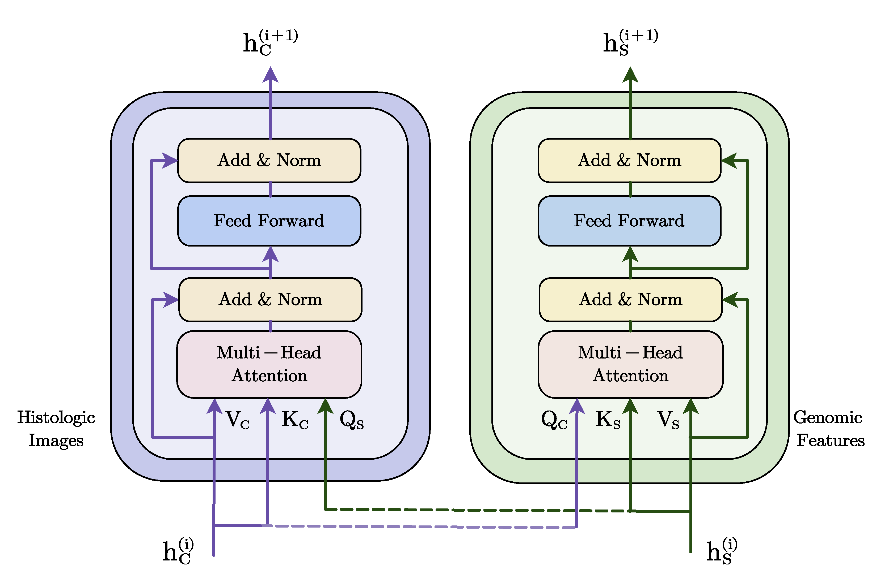

# Reproduction of bimodal fusion model via Cross-Attention Transformer 

  In this work, we reproduce the bimodal fusion Cross-Attention Transformer [^1] in this task. This bimodal fusion model is divided into three modules. In the first module, we carry out tokenization by convolutional stem layers and positional encoding next on the features extracted from three unimodal feature encoders. The second module correlates the features from any two of all three modalities through Cross-Attention (more details are depicted in Fig. 9), in an attempt to fully extract the shared components and retain the unique components of a single modality. Clearly there are $C_{3}^{2}=3$ possibilities for pair by pair fusion way, such as the fusion of histologic images modality $h_c^0$ and cell graphs modality $h_g^0$. Suppose $\left(h_{c}^{j}, h_{g}^{j}\right)$ denote the output of features $\left(h_{c}^{0}, h_{g}^{0}\right)$ passing through the dual-current Transformer at the $j^{\text {th}}$ layer. In the $(j+1)^{t h}$ layer, we compute Query, Key and Value matrices by linear transformation respectively based on the input $h_{c}^{j}$ and $h_{g}^{j}$. Therefore, attention from each modality generates features based on the relevant information of the other modality. The above process can be expressed as follows:

$$
\begin{equation}
    \begin{gathered}
        Q_{\mathrm{i}}=W_{Q_i} \cdot h_{i}\\
        K_{\mathrm{i}}=W_{k_i} \cdot h_{i}\\
        V_{\mathrm{i}}=W_{V_i} \cdot h_{i}\\
        h_{m}^{j+1}=T_{f_1}^{j+1}(\mathrm{SparseAttention}(Q_{m}^{j+1}, K_{n}^{j+1}, V_{n}^{j+1}))\\
        h_{n}^{j+1}=T_{f_2}^{j+1}(\mathrm{SparseAttention}(Q_{n}^{j+1}, K_{m}^{j+1}, V_{m}^{j+1}))\\
        m, n \in \{\mathrm{c}, \ \mathrm{g}, \ \mathrm{s}\}
    \end{gathered} 
\end{equation}
$$

where $T_f\left( \cdot \right)$ stands for the processing of cross-attention Transformer blocks and $\mathrm{SparseAttention}$ represents the operation of sparse attention introduced above.
And in the third module, we concatenate the final paired features and the output is the result of bimodal fusion. So we can put the result into the corresponding fully connected layer for Cox regression. 

    <strong>Fig.9:</strong> The network architecture of Cross-Attention: The Cross-Attention Transformer    module is a dual-stream Transformer, this module has two parallel Transformer encoder and the Query matrices between two modalities are exchanged in a cross-stream manner. It puts a pair of features to Cross-Attention Transformer layers, and then generates a pair of final output features that contain mutual information.

The method differs from Multimodal Co-Attention Transformer proposed by Chen et al. [^2]in that we make full use of cross-attention mechanism by using every modality features as queries respectively rather than using genomic features as queries only. What's more, Chen et al. constructed the model across multiple WSIs for MIL while we model image regions-of-interest (ROIs) for MML. 

[^1]: Lu, Jiasen, et al. "Vilbert: Pretraining task-agnostic visiolinguistic representations for vision-and-language tasks." *Advances in neural information processing systems* 32 (2019).
[^2]: Chen, R. J., Lu, M. Y., Wang, J., Williamson, D. F., Rodig, S. J., Lindeman, N. I., & Mahmood, F. (2020). Pathomic fusion: an integrated framework for fusing histopathology and genomic features for cancer diagnosis and prognosis. *IEEE Transactions on Medical Imaging*, *41*(4), 757-770.
