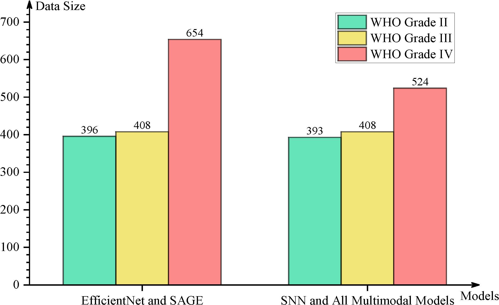

# Implementation Details

## Data Description

​    To validate the multimodal paradigm for integrating histology and genomic features, we used glioma and clear cell renal cell carcinoma (CCRCC) data from TCGA. TCGA is a well-known cancer database that has considerable genomic information and cell slice image data. The dataset used in our work is the Glioma dataset from TCGA-GBMLGG and CCRCC dataset from TCGA-KIRC. The histology images, cell graphs and genomic features used in our work are consistent with those of Pathomic Fusion[^1]  (PaF) .

​    We selected 769 patients from TCGA-GBMLGG. For each patient, we selected 1-3 $20\mathrm{x} \ 1024 \times 1024$ histology regions of interest (ROIs) ($0.5 / \mathrm{pixel}$) from diagnostic slides (a total of 1505) curated by Mobadersany et al.[^2]  and matched all images to standard H\&E histological images using sparse staining normalization[^3]. Then we downloaded 320 genomic features curated from TCGA and cBioPortal[^4]. In this dataset, there are three categories of gliomas for grade classification (WHO Grade II, Grade III, and Grade IV). The amount of data contained in each category is shown in Fig. 1. When the same patient has multiple ROIs, we treat each ROI as independent data and then copy the genomic features and labels of this patient into multiple copies to pair with his ROIs. For different tasks, the integrity of all kinds of data cannot be guaranteed. In some cases, not all genomic features are available for all patients. As described by PaF[^1], 72 patients had missing molecular subtype (IDH mutation and 1p19q codeletion), 33 patients had missing histological subtype and grade labels, and 256 patients had missing mRNA-Seq data. Therefore, for some different tasks and models, the subsets of the data used are different. The details are shown in TABLE I. For clear cell renal cell carcinoma (CCRCC), we selected 417 patients from TCGA-KIRC. We collected at least 3 $512 \times 512 \ 40\mathrm{x}$ ROIs from each patient (a total of 1260), which were similarly normalized with stain normalization. In addition, we downloaded genomic features from CNV of genes and RNA-Seq selected in PaF[^1]. There are 13 corrupted cell graphs, so models with graph modality use a different dataset than other networks. The details are shown in Table TABLE I.

TABLE I:  Volume of data in different modalities

|     Model     | Glioma (Surv) | Glioma (Grade) | CCRCC (Surv) |
| :-----------: | :-----------: | :------------: | :----------: |
|     Path      |     1505      |      1458      |     1260     |
|     Omic      |      999      |      1325      |     1260     |
|     Graph     |     1505      |      1458      |     1247     |
|   PathOmic    |      999      |      1325      |     1260     |
|   GraphOmic   |      999      |      1325      |     1247     |
| PathGraphOmic |      999      |      1325      |     1247     |

​                                                                      Fig. 1: Histogram of category distribution in glioma.

## Data Augmentation

​    For TCGA-GBMLGG, when using EfficientNet to learn the representation of histologic images, due to the small number of histologic images, there are only 1505 $1024 \times 1024$ images without ignoring patients whose molecular subtypes and histological subtypes were missing, which maks it impossible to fully train deep CNN networks. Moreover, the histologic images are fine-grained, so we can segment them and then train our model better. Considering that the image size on ImageNet is $224 \times 224$ , we use a stride of 160 (stride = 160) to cut each original $1024 \times 1024$  image into $25 \ 224 \times 224$ subimages (shown in Fig. 2). For multimodal fusion, because it requires too much time to train the multimodal model with full 25x sub-images, we only randomly cut $224 \times 224$ subimages from the original $1024 \times 1024$ histologic image. For TCGA-KIRC, the histologic images are only $512 \times 512$, which is much smaller than the images in TCGA-GBMLGG. We only randomly cut $224 \times 224$ subimages for EfficientNet and the multimodal model. In addition, for both TCGA-GBMLGG and TCGA-KIRC, color jittering and random flips were also performed as data augmentation for both unimodal networks and multimodal fusion. 

Fig. 2: Data processing of histologic images. On the left, the histologic image of $1024 \times 1024$ is transformed into 25 $224 \times 224$  subgraphs. On the right, a block of $224 \times 224$ subgraphs is randomly taken from the histology image of $1024 \times 1024$.

## Loss Function

   We use different loss functions on different tasks. For survival outcome prediction, we use the Cox partial likelihood loss as the loss function, which is computed as follows:
  
$$
\begin{equation}
    L(\beta) = \prod_{i} \frac{\exp(\beta X^{(i)})}{\sum\limits_{j} \exp(\beta X^{(j)}) \cdot 1_{T_j > T_i}},
\end{equation}
$$

where $\beta$ is the parameter (vector form) in the Cox-model. The Cox-model here consists of two parts: baseline hazard function $h_0(t)$ and $\exp(\beta X)$, where $X$ is a vector of covariates $X^{(i)}$.

​     For grade classification, we use the cross entropy loss in the training process, which is computed as follows:

$$
\begin{equation}
    \mathrm{CossEntropy} = - \sum_{i} l_{i} \ln p_{i}
\end{equation}
$$

where $l_i$ is the label and $p_{i}$ is the logit.

​     Therefore, loss for both survival outcome prediction and grade classification can be computed with the following formula:

$$
\begin{equation}
    \mathrm{Loss} = \lambda_{\mathrm{Cox}}\mathrm{Loss}_{\mathrm{Cox}}{\mathrm{1}_\mathrm{surv}} + \lambda_{\mathrm{nll}}\mathrm{Loss}_{\mathrm{nll}}{\mathrm{1}_\mathrm{grad}} + \lambda_{\mathrm{L1}}\mathrm{Loss}_{\mathrm{L1}}
\end{equation}
$$

where $\mathrm{Loss}\_{\mathrm{Cox}}$ and $\mathrm{Loss}\_{\mathrm{nll}}$ are Cox partial likelihood loss and negative log-likelihood loss, respectively, which are mentioned above. $\mathrm{Loss}\_{\mathrm{L1}}$ is derived from the L1-norm to make the parameters sparse. $\lambda\_{\mathrm{Cox}}$, $\lambda_{\mathrm{nll}}$ and $\lambda\_{\mathrm{L1}}$ are the coefficients corresponding to each loss. ${\mathrm{1}\_\mathrm{surv}}=1$ when the task is survival outcome prediction. ${\mathrm{1}\_\mathrm{grad}}=1$ has a similar meaning.

## Experimental Details

​    To exploit the given data to complete the survival analysis and reduce the uncertainty of error estimation, our experiments are held in 15-fold cross-validation, which followed the setup of PaF[^1]. The dataset is randomly divided into 15 non coincident subsets. For the test, the subset of the dataset is used as the test set, and the rest is used as the training set. In the training of each modality, the model is saved under each split to prevent the problem of information leakage during multimodal fusion. The hyperparameters and training strategies we set for survival outcome prediction and grade classification are shown in TABLE II and TABLE III. In addition to what is shown in the table, the details are also explained in 1) and 2).

### Experimental Details for unimodal networks

​    On glioma, during unimodal network training for survival outcome prediction, their setup of is not exactly same. EfficientNet, was initialized using pretrained weights from ImageNet. The SNN was initialized using the self-normalizing weights and the L1-norm with coefficients $3\times10^{-4}$ was added to make the parameters sparse. Because there are 320 genomic features, the input size for the omic vector is 320. SAGE was initialized in the same way as SNN. Optimizer Adam was used in the training of all unimodal networks with $\beta$ as the default, $5\times10^{-4}$ of weight decay for SNN and $4\times10^{-4}$  for CNN and SAGE. At the end of training, the model with the best results is selected on each split separately. The above training details are also used for grade classification on glioma and tasks on CCRCC, except that the input size for the omic vector becomes 80 and 362 when training the SNN.

### Experimental Details for multimodal fusion

   On glioma, during multimodal fusion training for survival outcome prediction, we trained the parameters for the fusion part with the unimodal network modules frozen in the first 10 epochs. Then we unfroze EfficientNet, SNN and SAGE. The optimizer Adam was used in the training of these three networks with $\beta_{1}=0.5$, $\beta_{2}=0.999$ and $4\times10^{-4}$ of weight decay. We added the L1-norm with coefficients of $3\times10^{-4}$ to the SNN in Cy-Atten. For all multimodal Transformers mentioned above, we trained 200-300 epochs and selected the best output as the experimental result. All the training details were also used for grade classification and tasks on CCRCC.

TABLE II:  Training hyperparameters and details for survival outcome prediction on glioma and CCRCC. To accelerate the convergence speed, Adam was used in all model training. The maximum number of iterations (T\_max) for all networks trained with the cosine annealing schedule is 10. For SAGE, the network is trained with a batch size of 32 on Glioma and 128 on CCRCC.

|          Model           | Optimizer |           Fusion            | LR     | BS       | Decay of LR | Tfnum | Epoch |
| :----------------------: | :-------: | :-------------------------: | ------ | -------- | ----------- | ----- | ----- |
| EfficientNet (Path Only) |   Adam    |            None             | 0.0004 | 80       | Cosine      | None  | 30    |
|     SNN (Omic Only)      |   Adam    |            None             | 0.002  | 64       | Linear      | None  | 50    |
|    SAGE (Graph Only)     |   Adam    |            None             | 0.0001 | 32 (128) | Linear      | None  | 50    |
|      Cro-Atten (PO)      |   Adam    |       Cross-Attention       | 0.0003 | 32       | Cosine      | 4     | 250   |
|      Cro-Atten (GO)      |   Adam    |       Cross-Attention       | 0.0003 | 32       | Cosine      | 6     | 200   |
|    Tri-Co-Atten (PGO)    |   Adam    |   TriBERT’s Co-attention    | 0.0003 | 32       | Cosine      | 4     | 200   |
|        MulT (PGO)        |   Adam    |   Multimodal Transformer    | 0.0003 | 32       | Cosine      | 2     | 200   |
|      Cy-Atten (PGO)      |   Adam    | Cycle-Attention Transformer | 0.0003 | 32       | Cosine      | 1     | 200   |

TABLE III: Training hyperparameters and details for grade classification on glioma. To accelerate the convergence speed, Adam was used in all model training. The maximum number of iterations (T max) for all networks trained with the cosine annealing schedule is 10.

|          Model           | Optimizer |           Fusion            | LR     | BS   | Decay of LR | Tfnum | Epoch |
| :----------------------: | :-------: | :-------------------------: | ------ | ---- | ----------- | ----- | ----- |
| EfficientNet (Path Only) |   Adam    |            None             | 0.0004 | 80   | Cosine      | None  | 30    |
|     SNN (Omic Only)      |   Adam    |            None             | 0.002  | 64   | Linear      | None  | 50    |
|    SAGE (Graph Only)     |   Adam    |            None             | 0.0001 | 32   | Linear      | None  | 50    |
|      Cro-Atten (PO)      |   Adam    |       Cross-Attention       | 0.0003 | 32   | Cosine      | 6     | 200   |
|      Cro-Atten (GO)      |   Adam    |       Cross-Attention       | 0.0003 | 32   | Cosine      | 4     | 300   |
|    Tri-Co-Atten (PGO)    |   Adam    |   TriBERT’s Co-attention    | 0.0003 | 32   | Cosine      | 4     | 200   |
|        MulT (PGO)        |   Adam    |   Multimodal Transformer    | 0.0003 | 32   | Cosine      | 2     | 200   |
|      Cy-Atten (PGO)      |   Adam    | Cycle-Attention Transformer | 0.0003 | 32   | Cosine      | 1     | 200   |

[^1]: Chen, R. J., Lu, M. Y., Wang, J., Williamson, D. F., Rodig, S. J., Lindeman, N. I., & Mahmood, F. (2020). Pathomic fusion: an integrated framework for fusing histopathology and genomic features for cancer diagnosis and prognosis. *IEEE Transactions on Medical Imaging*, *41*(4), 757-770.
[^2]: Mobadersany, P., Yousefi, S., Amgad, M., Gutman, D. A., Barnholtz-Sloan, J. S., Velázquez Vega, J. E., ... & Cooper, L. A. (2018). Predicting cancer outcomes from histology and genomics using convolutional networks. *Proceedings of the National Academy of Sciences*, *115*(13), E2970-E2979.
[^3]: Vahadane, A., Peng, T., Sethi, A., Albarqouni, S., Wang, L., Baust, M., ... & Navab, N. (2016). Structure-preserving color normalization and sparse stain separation for histological images. *IEEE transactions on medical imaging*, *35*(8), 1962-1971.
[^4]: Cerami, E., Gao, J., Dogrusoz, U., Gross, B. E., Sumer, S. O., Aksoy, B. A., ... & Schultz, N. (2012). The cBio cancer genomics portal: an open platform for exploring multidimensional cancer genomics data. *Cancer discovery*, *2*(5), 401-404.
