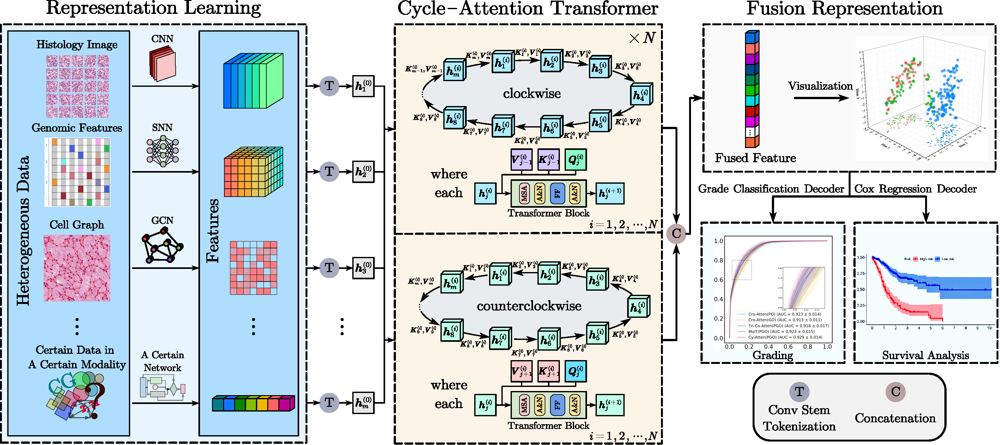

# EMTCT: Efficient Multimodal Tiny Cycle-Attention-Attention-Transformer Toward Cancer Diagnosis


## Abstract:

In this work, we propose a Tiny  Cycle-Transformer model for multimodal cancer survival analysis based on Cycle-SparseAttention. Compared to similar multimodal work, our work greatly reduces the number of parameters in the fusion part model (the number of our fusion part model's parameters only achieves $\mathbf{10^{4}}$), and achieves the State-of-the-Art effect (Cindex: 0.863 in survival outcome prediction, and ACC: 0.772, AUC: 0.929 in grade classification) in several multimodal cancer survival analysis tasks with histology images, genomic features, and cell graph data of Glioma cancer from TCGA database.




## **Dataset:**

We use glioma and clear cell renal cell carcinoma (CCRCC) data from the TCGA. TCGA is a well-known cancer database, which has a lot of genomic information and cell slice image data. The dataset used in our work is the Glioma dataset from the TCGA-GBMLGG and CCRCC dataset from the TCGA-KIRC. The histology images, cell graphs and genomic features used in our work is consistent with those of Richard J. Chen et al. The data can be downloaded from the [following link](https://drive.google.com/drive/u/1/folders/1swiMrz84V3iuzk8x99vGIBd5FCVncOlf) (The checkpoints stored are not the same as ours).


## Enviroment Setup

Our models are trained with NVIDIA GPUs (NVIDIA RTX A2000, NVIDIA RTX A4000, NVIDIA A30 and NVIDIA A40), torch = 1.8.1 and torch_geometric = 2.0.4.  Richard J. Chen's cell graphs are stored with torch_geometric = 1.3.0, so there may be incompatibility issues when reading.


## Train and Test

### Representation Learning

You can choose the task type by selecting 'surv' or 'grade' at the 'exp_name' and 'task'. Similarly, you can change the mode by changing 'mode' and 'model_name'. The following commands are used to train SAGE for survival outcome prediction and grade classification, respectively. Detailed training parameters are described in the article.

```
python train_cv.py  --exp_name surv_15_rnaseq --task surv --mode graph --model_name graph --niter 10 --niter_decay 150 --batch_size 32 --lr 0.0001 --begin_k 1 --init_type max --reg_type none --lambda_reg 0 --gpu_ids 0 --is_picture 1 --log_root surv_log --log_name log1 --save_best_function 1 --save_pred 1
```

```
python train_cv.py  --exp_name grad_15 --task grad --mode graph --model_name graph --niter 10 --niter_decay 190 --batch_size 32 --lr 0.0003 --init_type max --reg_type none --lambda_reg 0 --gpu_ids 0 --label_dim 3 --begin_k 1 --act LSM --is_picture 1 --log_root grad_log --log_name log2 --save_best_function 1 --save_pred 1 
```


### Multimodal Models

The following commands are used to train Cro-Atten (PathOmic) for survival outcome prediction and grade classification, respectively. You can choose Cro-Atten(GraphOmic) by changing the 'mode' and 'model_name' according to your needs. Detailed training parameters are described in the article.

```
python train_cv.py --exp_name surv_15_rnaseq --task surv --mode pathomic --model_name pathomic_fusion --niter 10 --niter_decay 150 --lr 0.0003 --beta1 0.5 --fusion_type pofusion --mmhid 64 --use_bilinear 1 --use_vgg_features 0 --gpu_ids 0 --omic_gate 0 --use_rnaseq 1 --input_size_omic 320 --batch_size 32 --finetune 1 --myfusion CrossAttention --optimizer_type adam --Tfnum 4 --lastnum 0 --begin_k 1 --lr_policy cosine --reg_type none --input_size_path 224 --data_Augmentation 0 --position_C 1 --position_S 1 --use_conv_stem 1 --use_sparsemax 1 --is_picture 1 --log_root surv_log --log_name log3 --save_best_function 1 --save_pred 1 
```

```
python train_cv.py --exp_name grad_15 --task grad --mode pathomic --model_name pathomic_fusion --niter 10 --niter_decay 190 --batch_size 32 --lr 0.0003 --beta1 0.5 --fusion_type pofusion --mmhid 64 --use_bilinear 1 --use_vgg_features 0 --gpu_ids 0 --path_gate 0 --omic_scale 2 --act LSM --label_dim 3 --finetune 1 --myfusion CrossAttention --Tfnum 6 --lastnum 0  --use_conv_stem 1 --use_sparsemax 1 --position_C 1 --position_S 1 --input_size_path 224 --path_dim 32 --omic_dim 32 --input_size_omic 80 --begin_k 1 --lr_policy cosine --reg_type none --is_picture 1 --log_root grad_log --log_name log4 --save_pred 1
```

The parameters in the following commands are used to train Cy-Atten (PathGraphOmic) for survival outcome prediction and grade classification, respectively. You can choose Tri-Co-Atten or MulT by changing the 'mode' and 'model_name' according to your needs. Detailed training parameters are described in the article.

```
python train_cv.py --exp_name surv_15_rnaseq --task surv --mode pathgraphomic --model_name pathgraphomic_fusion --niter 10 --niter_decay 190 --batch_size 32 --finetune 1 --lr 0.0003 --beta1 0.5 --lr_policy cosine --fusion_type pofusion_A --mmhid 192 --use_bilinear 1 --Tfnum 1 --lastnum 0 --gpu_ids 0 --optimizer_type adam --reg_type omic --omic_gate 0 --grph_scale 2 --input_size_path 224 --use_rnaseq 1 --use_sparsemax 1 --input_size_omic 320 --myfusion Cy_Atten --graph_model SAGE --begin_k 1 --topology 0 --position_C 1 --position_G 1 --position_S 1 --is_picture 1 --log_root surv_log --log_name log5 --save_best_function 1 --save_pred 1
```

```
python train_cv.py --exp_name grad_15 --task grad --mode pathgraphomic --model_name pathgraphomic_fusion --niter 10 --niter_decay 190 --lr 0.0003 --batch_size 32 --finetune 1 --beta1 0.5 --fusion_type pofusion_B --mmhid 192 --use_bilinear 1 --gpu_ids 0 --path_gate 0 --act LSM --label_dim 3 --Tfnum 1 --lastnum 0 --optimizer_type adam --reg_type omic --input_size_path 224 --position_C 1 --position_G 1 --position_S 1 --myfusion Cy_Atten --graph_model SAGE --lr_policy cosine --use_sparsemax 1 --begin_k 1 --is_picture 1 --log_root grad_log --log_name log6 --save_best_function 1 --save_pred 1
```

### Partial Results
\begin{table*}[!t]
  \centering
  \caption{the experimental results and the amount of fusion parameters for survival outcome prediction}
    \setlength\tabcolsep{0.55em}{
    \begin{tabular}{c|ccc|c}
    \toprule
    Model & C-Index (Glioma)    & C-Index (CCRCC)  & Overall & \makecell{Fusion Para\_num \\ for Surv}  \\
    \hline
    EfficientNet (Path Only) & 0.727 ± 0.016 & 0.626 ± 0.013 & 0.677 & None \\
    SNN (Omic Only)   & 0.819 ± 0.038 & 0.738 ± 0.029 & 0.780 & None \\
    SAGE (Graph Only)  & 0.732 ± 0.023 & 0.658 ± 0.024 & 0.695 & None \\
    Kronecker Product (PO) \cite{03chen}& 0.820 ± 0.009  & 0.719 ± 0.031 & 0.770 & 170130 \\
    Kronecker Product (GO) \cite{03chen}& 0.812 ± 0.010  & 0.686 ± 0.024 & 0.749 & 92305 \\
    Kronecker Product (PGO) \cite{03chen}& 0.826 ± 0.009  & 0.720 ± 0.028 & 0.773 &1276145 \\
    Cro-Atten (PO) \cite{lu2019vilbert} & 0.856 ± 0.026 & 0.745 ± 0.027 & 0.801 &6837 \\
    Cro-Atten (GO) \cite{lu2019vilbert}& 0.845 ± 0.033 & 0.743 ± 0.023 & 0.797 & 6837 \\
    Tri-Co-Atten (PGO) \cite{rahman2021tribert} & 0.838 ± 0.026  & 0.757 ± 0.027 & 0.797 & 10177 \\
    MulT (PGO) \cite{tsai2019multimodal}& 0.857 ± 0.029  & 0.740 ± 0.026 & 0.799 & 48865 \\
    \textbf{Cy-Atten (PGO) ours}& \textbf{0.863 ± 0.026}  & \textbf{0.765 ± 0.026} & \textbf{0.814} & 5311 \\
    \bottomrule
    \end{tabular}}
    \begin{minipage}{\linewidth}\vspace{0.8ex}
    *C-Index of all strategies in glioma and CCRCC survival prediction. Cy-Atten is the fusion strategy based on Transformer mentioned in this paper. Kronecker Product is the other strategy proposed by Richard J. Chen et al\cite{03chen} and we refer to the results presented in their paper for comparison.
    \end{minipage}
  \label{tab:surv results}
\end{table*}


